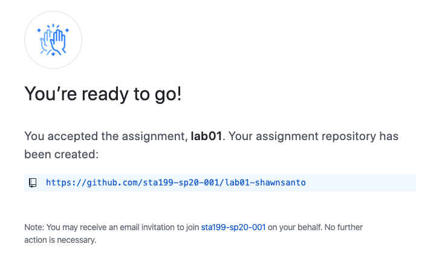

```{marginfigure}
R is the name of the programming language itself and RStudio is a 
convenient interface.
```

This lab will go through much of the same workflow we demonstrated in class this
week. The main goal is to reinforce our demo of R and RStudio, which we will be 
using throughout the course both to learn statistical concepts discussed in 
the course and to make informed conclusions through real data analysis.

```{marginfigure}
git is a version control system (like "Track Changes" features from 
Microsoft Word but more powerful) and GitHub is the home for your Git-based 
projects on the internet (like DropBox but much better)
```

As the labs progress, you are encouraged to explore beyond what the labs 
dictate; a willingness to experiment will make you a much better programmer. 
Before we get to that stage, however, you need to build some basic fluency in R. 
Today we begin with the fundamental building blocks of R and RStudio: the 
interface, reading in data, and basic commands.

To make versioning simpler, this is an individual lab. Additionally, we want to 
make sure everyone gets a significant amount of time at the steering wheel. 

Your lab TA will lead you through the Getting Started, Packages, and and 
Warm up sections.

# Getting Started

Each of your assignments will begin with similar steps below. You saw these 
once in class, and they’re outlined in detail here again. Going forward each 
lab will start with a “Getting started” section but details will be a bit more 
sparse than this. You can always refer back to this lab for a detailed list of 
the steps involved for getting started with an assignment.

## Clone Assignment Repo

- First, go to the link for the assignment in order to create your personal 
  private repository corresponding to the assignment. This link may be found 
  at https://classroom.github.com/a/tle2iwF6. Accepting the assignment creates 
  a repository similar to lab01-[github_name]
  
  

- Next, navigate to the course GitHub website, and click on the repository 
  corresponding to your account. For example, mine would be lab-01-shawnsanto. Or, 
  simply go to the repository you just created (there is a link provided when 
  you created the repository)
  
  

- Click on the green Clone or download button on that repository, and copy the 
  git URL (it should end in .git)

  

- Go to RStudio Cloud and into the STA 199 course workspace. Create a New 
  Project from Git Repo and copy the git URL from your personal workspace. 
  Make sure “Add packages from the base project” is checked. 
  
  
  

- Click OK, and you should see the contents from your GitHub repo in the `Files`
  pane in RStudio. 

## Configure git

There is one more piece of housekeeping we need to take care of before we get 
started. Specifically, we need to configure git so that RStudio can communicate 
with GitHub. This requires two pieces of information: your email address and 
your name.

To do so, you will use R function `use_git_config()` from package `usethis`. 

Type the following lines of code in the **console**, where you use your own
name and email address you provided GitHub.

```{r eval=FALSE}
library(usethis)
use_git_config(user.name="your name", user.email="your email")
```

For example, mine would be 

```{r eval=FALSE}
library(usethis)
use_git_config(user.name="Shawn Santo", user.email="shawn.santo@duke.edu")
```

# Packages

In this lab we will work with two packages: `datasauRus` which contains the 
datasets, and `tidyverse` which is a collection of packages for doing data 
analysis in a "tidy" way. 

At any point, you can Knit your document and see the results.

Are both `tidyverse` and `datasauRus` installed? If not, install them in the
console (refer to Tuesday's slides).

```{r warning=FALSE, message=FALSE}
library(tidyverse) 
library(datasauRus)
```

# Warm up

Before we introduce the data, we're going to go through our first stage, commit,
and push version control cycle.

## Project name: 

Currently your project is called *Untitled Project*. Update the name of your 
project to be "Lab 01 - Hello R" in the header of the RStudio Cloud project.

## YAML: 

The top portion of your R Markdown file (between the three dashed lines) is 
called the YAML. It stands for “YAML Ain’t Markup Language”. It is a human 
friendly data serialization standard for all programming languages. All you 
need to know is that this area is called the YAML (we will refer to it as such) 
and that it contains meta information about your document.

Open the R Markdown (Rmd) file in your project, change the author name to your 
name, and knit the document.

## Commiting changes:

Now, go to the Git pane in your RStudio instance. This will be in the top right 
hand corner in a separate tab.

If you have made and saved changes to your Rmd file, you should see it listed 
here. Click on **Diff**. This shows you the *diff*erence between the last 
committed state of the document and its current state that includes your 
changes. If you're happy with these changes, stage them, and
write "Update author name" in the **Commit message** box, then click **Commit**.


Of course, you don’t have to commit after every change, as this would get quite 
cumbersome. You should consider committing states that are meaningful to you 
for inspection, comparison, or restoration. In the first few assignments we 
will tell you exactly when to commit and in some cases, what commit message to 
use. As the semester progresses we will let you make these decisions.

## Pushing changes: 

Now that you have made an update and committed this change, it's time to push 
these changes to the web! Or more specifically, to your repo on GitHub so that 
others can see your changes. By others, we mean the course teaching 
team (your repos in this course are private to you and us, only). 

In order to push your changes to GitHub, click on **Push**. This will prompt a 
dialog box where you first need to enter your user name, and then your password. 
We *will* soon teach you how to save your password so you don't have to enter 
it every time.

# Data

```{marginfigure}
If it's confusing that the data frame is called `datasaurus_dozen` when it 
contains 13 datasets, you're not alone! Have you heard of a [baker's dozen](https://en.wikipedia.org/wiki/Dozen#Baker's_dozen)?
```

The data frame we will be working with today is called `datasaurus_dozen` and 
it's in the `datasauRus` package. Actually, this single data frame contains 
13 datasets, designed to show us why data visualization is important and how 
summary statistics alone can be misleading. The different datasets are marked 
by the `dataset` variable.

To find out more about the dataset, type the following in your **console**.
```{r eval=FALSE}
?datasaurus_dozen
```

A question mark before the name of an object will always bring up its help 
file. This command must be run in the **console**.

1. Based on the help file, how many rows and how many columns does 
   `datasaurus_dozen` have? What are the variables included in the data frame? 
   Add your responses to your lab report. When you're done, commit your changes 
   with the commit message "Added answer for Ex 1", and push.

Let's take a look at what these datasets are. To do so we can make 
a *frequency table* of the dataset variable:

```{r}
datasaurus_dozen %>%
  count(dataset) %>%
  print(13)
```

```{marginfigure}
Matejka, Justin, and George Fitzmaurice. "Same stats, different graphs: 
Generating datasets with varied appearance and identical statistics through 
simulated annealing." Proceedings of the 2017 CHI Conference on Human Factors 
in Computing Systems. ACM, 2017.
```

The original Datasaurus (`dino`) was created by Alberto Cairo in [this great blog post](http://www.thefunctionalart.com/2016/08/download-datasaurus-never-trust-summary.html). 
The other Dozen were generated using simulated annealing and the process is 
described in the paper *Same Stats, Different Graphs: Generating Datasets with*
*Varied Appearance and Identical Statistics* through Simulated Annealing by 
Justin Matejka and George Fitzmaurice. In the paper, the authors simulate a 
variety of datasets that the same summary statistics to the Datasaurus but have 
very different distributions.

# Data visualization and summary

2. Plot `y` vs. `x` for the `dino` dataset. Then, calculate the correlation 
   coefficient between `x` and `y` for this dataset.

Below is the code you will need to complete this exercise. Basically, the 
answer is already given, but you need to include relevant bits in your Rmd 
document and successfully knit it and view the results.

Start with the `datasaurus_dozen` and pipe it into the `filter()` function to 
filter for observations where `dataset == "dino"`. Store the resulting filtered 
data frame as a new data frame called `dino_data`.

```{r}
dino_data <- datasaurus_dozen %>%
  filter(dataset == "dino")
```

There is a lot going on here, so let's slow down and unpack it a bit. 

First, the pipe operator: `%>%`, takes what comes before it and sends it as the
first argument to what comes after it. So here, we're saying `filter` the 
`datasaurus_dozen` data frame for observations where `dataset == "dino"`.

Second, the assignment operator: `<-`, assigns the name `dino_data` to the 
filtered data frame.

Next, we need to visualize these data. We will use the `ggplot()` function for 
this. Its first argument is the data you're visualizing. Next we define the 
`aes`thetic mappings. In other words, the columns of the data that get mapped 
to certain aesthetic features of the plot, e.g. the `x` axis will represent the 
variable called `x` and the `y` axis will represent the variable called `y`. 
Then, we add another layer to this plot where we define which `geom`etric shapes
we want to use to represent each observation in the data. In this case we want 
these to be points, hence `geom_point()`.

```{r fig.fullwidth=TRUE}
ggplot(data = dino_data, mapping = aes(x = x, y = y)) +
  geom_point()
```

For the second part of this exercises, we need to calculate a summary statistic:
the correlation coefficient. Correlation coefficient, often referred to as $r$ 
in statistics, measures the linear association between two variables. 
You will see that some of the pairs of variables we plot do not have a linear 
relationship between them. This is exactly why we want to visualize first: 
visualize to assess the form of the relationship, and calculate $r$ only if 
relevant. In this case, calculating a correlation coefficient really doesn't 
make sense since the relationship between `x` and `y` is definitely not 
linear.

For illustrative purposes, let's calculate correlation coefficient 
between `x` and `y`.

```{marginfigure}
Start with `dino_data` and calculate a summary statistic that we will call 
`r` as the `cor`relation between `x` and `y`.
```

```{r}
dino_data %>%
  summarize(r = cor(x, y))
```

*This is a good place to pause, commit changes with the commit message*
*"Added answer for Ex 2", and push.*

3. Plot `y` vs. `x` for the `star` dataset. You can (and should) reuse code we 
   introduced above, just replace the dataset name with the desired dataset. 
   Then, calculate the correlation coefficient between `x` and `y` for this 
   dataset. How does this value compare to the `r` of `dino`?

*This is another good place to pause, commit changes with the commit message*
*"Added answer for Ex 3", and push.*

4. Plot `y` vs. `x` for the `circle` dataset. You can (and should) reuse code 
   we introduced above, just replace the dataset name with the desired dataset. 
   Then, calculate the correlation coefficient between `x` and `y` for this 
   dataset. How does this value compare to the `r` of `dino`?

*You should pause again, commit changes with the commit message* 
*"Added answer for Ex 4", and push.*

```{marginfigure}
Facet by the dataset variable, placing the plots in a 3 column grid, 
and don't add a legend.
```

Finally, let's plot all datasets at once. In order to do this we will make use 
of faceting.

```{r all-viz, eval=FALSE, fig.fullwidth=TRUE}
ggplot(datasaurus_dozen, aes(x = x, y = y, color = dataset))+
  geom_point()+
  facet_wrap(~ dataset, ncol = 3) +
  theme(legend.position = "none")
```

And we can use the `group_by()` function to generate all the summary 
correlation coefficients.

```{r all-r, eval=FALSE}
datasaurus_dozen %>%
  group_by(dataset) %>%
  summarize(r = cor(x, y)) %>%
  print(13)
```

5. Include the faceted plot and summary of the correlation coefficients in
   your lab write-up. To do this, add code chunks to your Rmd document and
   give the chunks an appropriate name. Below the code chunks, briefly
   comment on what you observe about the plots and correlation values. One to
   two sentences is sufficient.

You're done with the data analysis exercises, but we'd like to do two more 
things to customize the look of the report. 

## Resize your figures

We can customize the output for a particular R chunk by including chunk options.

6. In the R chunks you wrote for Exercises 2-5, customize the figure output
   dimensions as specified below.
   
   For Exercises 2-4, we want square figures. We can use `fig.height` and 
   `fig.width` as chunk options to adjust the height and width of figures. 
   Modify the chunks in Exercises 2-4 as follows:
   
    `r ''````{r exercise2, fig.height=5, fig.width=5}
    
    Code that created the figure
    
    ```
   
   For Exercise 5, modify your figure to have `fig.height=10` and 
   `fig.width=6`.
   
   Save and knit.
   
# Submission
   
To facilitate and expedite grading in this class, we’ll be submitting .pdf 
documents to [Gradescope](https://www.gradescope.com/). 
Once you are satisfied with your lab, Knit to PDF to 
create a .pdf document. You may notice that the formatting/theme of the 
report has changed – this is expected.

Once you’ve created this .pdf file, you’re done! Stage and commit all remaining 
changes, use the commit message “Done with Lab 1!” and push. Before you 
wrap up the assignment, make sure all documents are updated on your GitHub 
repo – we will be checking these to make sure you have been practicing how to 
commit and push changes.

Please only upload your PDF document to [Gradescope](https://www.gradescope.com/).
Before you submit the uploaded document, mark where each answer is to the
exercises. If any answer spans multiple pages, then mark all pages.