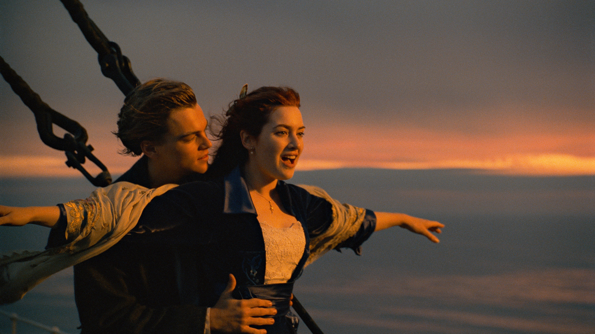

```{r include=FALSE}
knitr::opts_chunk$set(comment = "#>")
```

```{r include=FALSE}
library(tidyverse)
library(knitr)
```


## Introduction

```{r fig.margin=TRUE, eval=TRUE, echo=FALSE}

```

Today's dataset consists of over two-thousand records from the sinking of the 
RMS Titanic, a disaster faithfully depicted with a very high degree of 
historical accuracy in James Cameron's 1997 film*. On a cold April morning, the 
RMS Titanic struck an iceberg in the North Atlantic, broke apart and sank 
(spoiler warning), resulting in a tremendous loss of life. 

On the Titanic, passengers were either first class, second class, or third 
class, depending on the ticket they purchased. It is well known that survival 
probability after the sinking depended on the passenger's ticket class: over 
60% of the first class passengers survived, whereas only about 25% of the third 
class passengers survived (contrary to the film's depiction, there is no 
evidence that they were "locked in" below decks).

However, it appears that the crew fared even worse! Of the crewmembers, less 
than a quarter of them made it out alive. Does this information lead us to make 
conclusions one way or another regarding survival probability of third class 
passengers compared to crewmembers?

# Merge Conflicts (uh oh)

```{r fig.margin=TRUE, eval=TRUE, echo=FALSE}
include_graphics("img/merge-no-conflict.png")
```

You may have seen this already through the course of your collaboration last 
week in Lab 03. When two collaborators make changes to a file and push the file 
to their repository, git merges these two files.

```{r fig.margin=TRUE, eval=TRUE, echo=FALSE}
include_graphics("img/merge-conflict.png")
```


If these two files have conflicting content on the same line, git will produce a
**merge conflict**. Merge conflicts generally need to be resolved manually, 
as they require a human intervention:

```{r fig.margin=FALSE, eval=TRUE, echo=FALSE}
include_graphics("img/merge-conflict-identifiers.png")
```

To resolve the merge conflict, decide if you want to keep only your text, the 
text on GitHub, or incorporate changes from both texts. Delete the conflict 
markers `<<<<<<<`, `=======`, `>>>>>>>` and make the changes you want in the 
final merge.

**Assign numbers 1, 2, 3, and 4 to each of your team members** (if you have 3 
team members, just numbers 1 through 3). Go through the following steps in 
detail, which simulate a merge conflict. Completing this exercise will be part 
of the lab grade.

## Resolving a merge conflict

**Step 1: Everyone** clone your assignment repo into RStudio Cloud and open 
the R Markdown file. Don't forget to load in the necessary packages and 
configure git:

```{r eval = FALSE}
library(tidyverse) 
library(usethis)
use_git_config(user.name="your name", user.email="your email")
```

Member 4 should look at the group’s repo on GitHub.com to ensure that the other 
members’ files are pushed to GitHub after every step.

**Step 2: Member 1** Change the team name to your team name. 
*Knit, stage, commit, and push*.

**Step 3: Member 2** Change the team name to something different (i.e., not your
team name). *Knit, stage, commit, and push*. 

You should get an error.

Pull and review the document with the merge conflict. Show the error to your 
teammates. A merge conflict occurred because you edited the same part of the 
document as Member 1. Resolve the conflict with whichever name you want to keep,
then knit, stage, commit and push again.

**Step 4: Member 3** Write some narrative in the space provided for Exercise 5, 
then knit, commit, and push. 

You should get an error.

This time, no merge conflicts should occur, since you edited a different part of
the document from Members 1 and 2. Show the error to your teammates, then pull. 
Finally, knit, commit, and push.

## Caching GitHub credentials

If you would like your git password *cached* for a week for this project, type 
the following in the **Terminal**:

```{bash eval=FALSE}
git config --global credential.helper 'cache --timeout 604800'
```

You will need to enter your GitHub username and password one more time after 
caching the password. After that you won't need to enter your credentials for 
604800 seconds = 7 days. Note that this is only good for this single RStudio 
Cloud project -- you will need to cache your credentials for each project you 
create.

# The data

The data may be loaded with the following code:

```{r load-data, message=FALSE}
titanic <- read_csv("data/titanicsurvival.csv")
```

# Exercises

**Write all R code according to the style guidelines discussed in class.** Be
especially careful about staying within the 80 character limit, as demonstrated 
by your lab TAs! Finally, make sure your team name is correct. *Only one* 
submission should be made per team.

**All team members must commit and push to receive full credit**

1. What does each observation represent in this dataset? How many variables are 
in this dataset? What type of variable is each? 

#The information of each passenger.


2. Summarize the proportion of surviving passengers who survived in each class. 
What are the conditional probabilities of survival for each of the passenger 
classes, and among crewmembers? 

```{r}
titanic %>% 
    group_by(Class) %>% 
    count(Survive) %>% 
    mutate(proportion = n/sum(n))
```


3. Create a data visualization that examines overall survival probability of 
third-class passengers compared to crew members. Do not include information 
regarding first or second class passengers; we are not interested in them!

```{r}
visualiztion_data = titanic %>% 
    filter(Class %in% c("Third", "Crew"))

ggplot(visualiztion_data, 
       mapping = aes(x=Class, fill=Survive))+
    geom_bar(position = "fill")
```

The crew members have a lower survival rate.


4. You suspect that there is a case of Simpson's paradox going on. Recreate your
visualization from Exercise 3, this time faceting by categories of a third 
variable.


```{r}
ggplot(visualiztion_data, 
       mapping = aes(x=Class, fill=Survive)) +
    geom_bar(position = "fill") +
    facet_wrap(~Age)
```

```{r}
ggplot(visualiztion_data, 
       mapping = aes(x=Class, fill=Survive)) +
    geom_bar(position = "fill") +
    facet_wrap(~Sex)
```


5. What changed, and what might explain this change? Explain the relationship 
between the three variables in your visualization from Exercise 4 and what you 
might conclude.

## When we added sex as a covariate, we noticed that the crew members have 
## higher survival rates than third-class passengers in both gender groups.
## It could be that there are more way more female passengers in the third-class
## than female crew members. And females left earlier than males. Therefore, 
## when we consider all the population within each group together, the survival
## rate might be biased if we do not consider the sex variable.


    