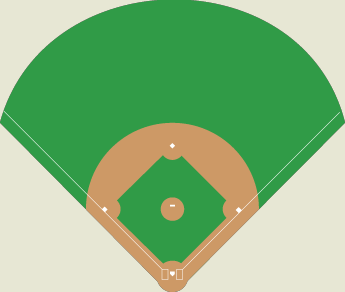

```{r include=FALSE}
knitr::opts_chunk$set(comment = "#>")
```

```{r include=FALSE}
library(tidyverse)
library(broom)
library(knitr)
```

# Introduction

```{r fig.margin=TRUE, eval=TRUE, echo=FALSE}

```

You will work with yearly baseball statistics for each team from the years 
2014 to 2018. You do not need any deep insight into the sport of baseball to 
successfully complete this lab. However, if you think you do not understand a 
specific variable and how it relates to baseball then feel free to ask.

A baseball team beats its opponent when it outscores its opponent. This happens 
when a team scores more runs than it allows in a game. The win percentage 
(percentage of games played that resulted in a win) of a team is related to 
the number of runs a team scores versus the number of runs a team allows over 
the course of a full season (usually 162 games). Runs scored and runs allowed
are a function of hits and walks, and hits allowed and walks allowed, 
respectively. You will explore some models that investigate the relationship 
between win percentage, and runs scored and runs allowed. 

## Getting started

Clone your assignment repo into RStudio Cloud and open 
the R Markdown file. Don't forget to load in the necessary packages and 
configure git:

```{r eval=FALSE}
library(tidyverse)
library(ggpol)
library(broom)

library(usethis)
use_git_config(user.name="your name", user.email="your email")
```

If you would like your git password *cached* for a week for this project, type 
the following in the **Terminal**:

```{bash eval=FALSE}
git config --global credential.helper 'cache --timeout 604800'
```

You will need to enter your GitHub username and password one more time after 
caching the password. After that you won't need to enter your credentials for 
604800 seconds = 7 days. Note that this is only good for this single RStudio 
Cloud project -- you will need to cache your credentials for each project you 
create.

## The data

The data is made available by package `Lahman`. This package has dozens of 
data frames on MLB baseball metrics. The data we will work with is a subset
of the `Teams` data frame - yearly statistics and standings for MLB teams.

If you have further interest in baseball data, I have installed package 
`Lahman` for you to explore some of the other datasets.

To get started, read in the data and save it as an object named `teams_default`.

```{r get_data, eval=FALSE, include=FALSE}
library(Lahman)

teams <- Teams %>% 
   filter(yearID >= 2014) %>% 
   janitor::clean_names() %>% 
   as_tibble()

teams <- teams %>% 
   select(-team_id, -ghome, -park, -(bpf:team_i_dretro)) %>% 
   select(name, franch_id, year_id, lg_id, div_id:fp, attendance)

write_csv(teams, "data/teams.csv")
```


```{r load_data, eval=FALSE}
teams_default <- read_csv("data/teams.csv")
```

# Exercises

**Write all R code according to the style guidelines discussed in class.** Be
especially careful about staying within the 80 character limit.

**All team members must commit and push to receive full credit.**

<b>
In addition to `lm()`, your code should only contain functions from the
loaded R packages.
</b>

## Exploratory data analysis

1. Add the following variables to `teams_default`. Save the resulting
   object as `teams`.

| New variable  | Name                    | Definition                                           |
|---------------|-------------------------|------------------------------------------------------|
| `win_pct`     | win percentage          | `w` / `g`, proportion of wins among all games played |
| `rd`          | run differential        | `r`− `ra`, runs scored minus runs allowed            |
| `hd`          | hit differential        | `h`− `ha`, hits minus hits allowed                   |
| `bbd`         | walk differential       | `bb`− `bba`, walks minus walks allowed               |
| `sod`         | strike out differential | `so` − `soa`, strikeouts minus strikeouts allowed    |

2. Create scatter plots of win percentage versus the four differential variables
   you created in Task 1: `rd`, `hd`, `bbd`, `sod`. Which variable appears to 
   have the strongest correlation with a team’s win percentage? Which variable 
   appears to have the weakest correlation with a team’s win percentage? 
   Compute these correlations.
   
3. Create a scatter plot to visualize the relationship between `rank` and 
   `win_pct`. Describe the relationship you observe.

4. Recreate your visualization in Exercise 3, but this time use 
   `geom_boxjitter()` from package `ggpol`. Briefly describe what this geom does
   and if the resulting visualization is more or less informative than that in
   Exercise 3.

## Model building (quantitative predictor)

```{marginfigure}
The linear model is of the form $\hat{y} = b_0 + b_1 x$.
```

5. Fit a linear model called `lm_rd`, where run differential is the explanatory
   variable and win percentage is the response. Based on the regression output, 
   write out the linear model.
   
6. Recreate your visualization in Exercise 2 for only the variable run
   differential, but now add the fitted regression line to the plot in a
   contrasting color to that of your points.
   
7. Interpret the slope and intercept of this linear model in the context of the
   data. Comment on whether or not the intercept interpretation makes sense 
   with regards to this data.
   
8. Determine the $R^2$ of the model and interpret it in context of the data.

9. Fit a linear model called `lm_sod`, where strike out differential is the 
   explanatory variable and win percentage is the response. Based on the 
   regression output, write out the linear model.
   
```{marginfigure}
You will need to get statistics `R` and `SO` from `Team Standard Batting`
and `Team Standard Pitching`, and then take their respective differences
to get the 2019 run and strikeout differentials.
```   

10. Choose an MLB team. Go to
    https://www.baseball-reference.com/leagues/MLB/2019.shtml#all_teams_standard_batting
    and get their 2019 statistics for run differential and strikeout 
    differential. Using each of your models, `lm_rd` and `lm_sod`, which model
    does better at predicting your selected team's actual 2019 win percentage?

## Model building (categorical predictor)

11. Fit a linear model called `lm_rank`, where rank is the explanatory
    variable and win percentage is the response. Based on the regression output, 
    write out the linear model.
    
12. Interpret the coefficients of model `lm_rank`.

```{marginfigure}
Try `mutate()` and `fct_relevel()`.
```

13. Refit your model from Exercise 11, but set the baseline level to when the
    rank is 5. Save this linear model as an object called `lm_rank_base5`.
    How do the coefficients of this model compare to those in Exercise 11?
    
14. Compare $R^2$ for models `lm_rank` and `lm_rank_base5`. Is this what you
    would expect? Explain your answer.

## Submission

Knit to PDF to create a PDF document. Stage and commit all remaining changes,
and push your work to GitHub. Make sure all files are updated on your 
GitHub repo.

Please only upload your PDF document to Gradescope. Associate the “Overall” 
graded section with the first page of your PDF, and mark where each answer 
is to the exercises. If any answer spans multiple pages, then mark all pages.

Only one team member needs to submit for the group. After you hit submit, 
go to View or edit group and select all your team members from the drop-down
menu.


